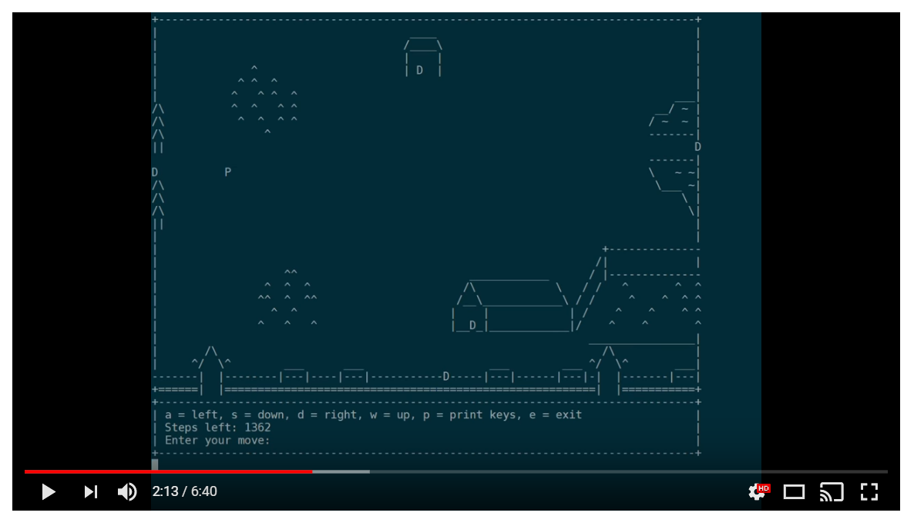
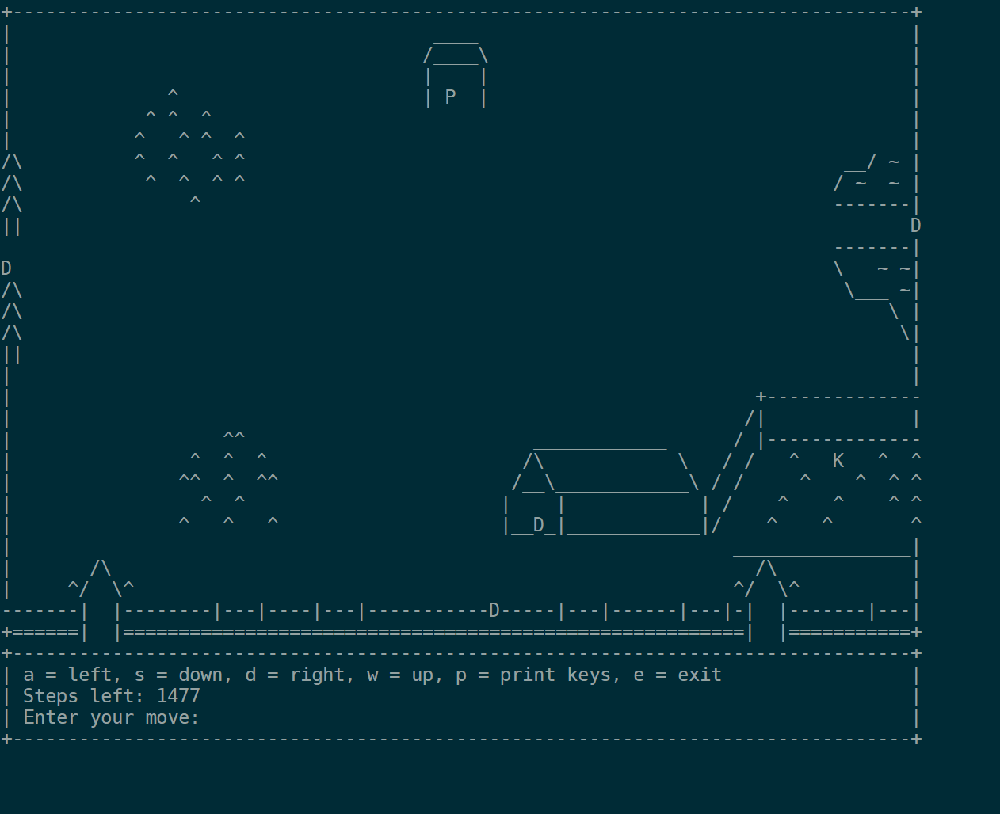
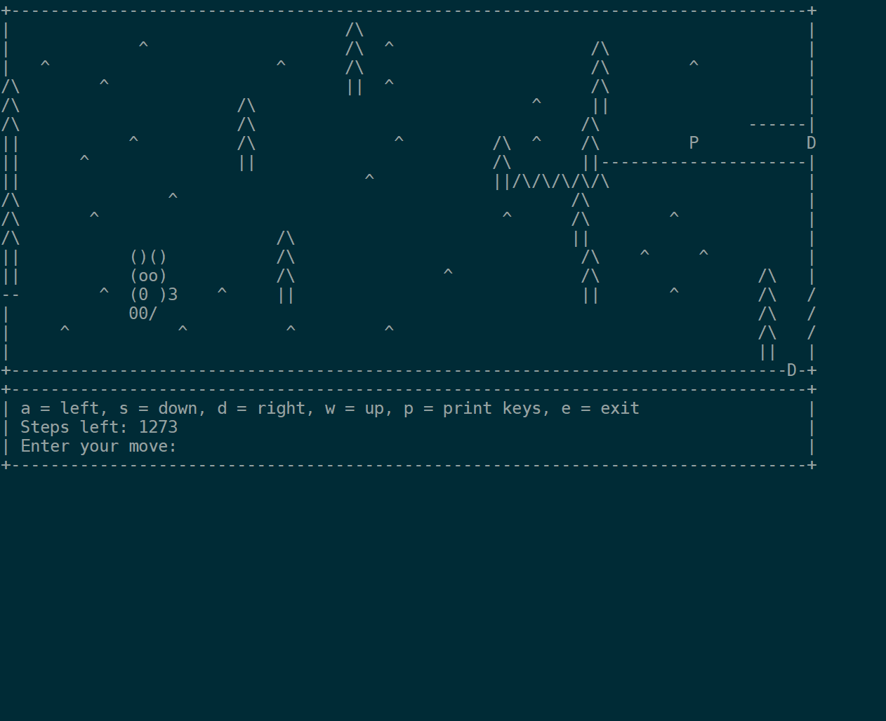
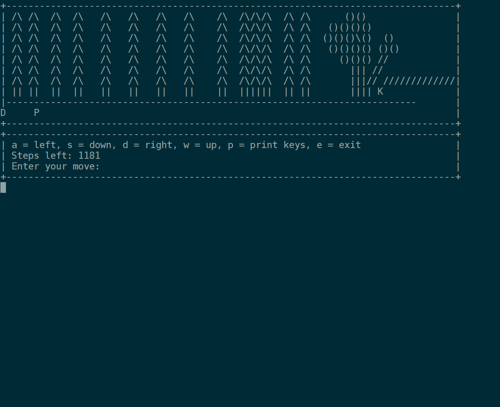

Valley of the Moon
==================

This repo is my final project for Oregon State's CS 162 Intro to Computer Science II Class.
The game is entirely text based and runs in the console. It implements a 2D pointer linked structure
for the map system, and base/child classes for each space.

The goal of the game is for the player to collect all of the keys and make it to the castle before
they run out of steps.

> Literally an insane amount of effort put into this project. One of the best that I have ever seen,
> 10 points extra credit! - TA

## Install
The game requires Linux/Unix console for refreshing the screen. If you are on Windows it is
reccomended that you [install Bash Ubuntu on
Windows](https://msdn.microsoft.com/en-us/commandline/wsl/install-win10)

Clone the directory:
```
git clone https://github.com/pattrickrice/valley-of-the-moon.git
cd valley-of-the-moon
```

Smash that makefile and start the game
```
make
./game
```

##screenshots

<a href="https://www.youtube.com/watch?time_continue=129&v=0XQPWDwvvvU"></a> 





Thanks for viewing
